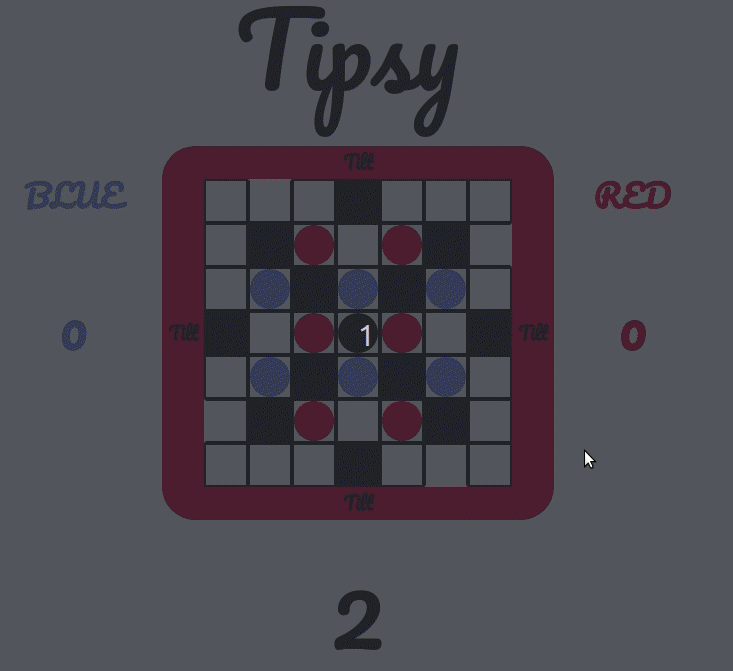

# TIPSY SYMFONY

> Give it a lift & make 'em shift

Tipsy is a game were the board can be tilt to move puck out of it, and they are put back on the board flipped.

The aim is to be the first to get all 6 of your pucks flipped, or to exit the black puck.

Each time a puck go out of the board, it is flipped and replaced on the board.



## How to install

```
make install
```

## How to run locally

```
make run
```
Access to the url on : http://localhost:8000

## How to run tests

```
make test
```

## How to deploy

You can deploy this app wherever you want, all you need is :
- an host with **docker on it**
- open the port 8080 on the host
- .pem key

Then by running this command :
```
key=<path_to_your_key> user=<user_on_remote> host=<remote_host> make deploy
```

It will :
- copy the app on the remote (on ```~/tipsy```)
- install the dependencies
- start the app

## How is it done?

This project is using (symfony)[https://symfony.com/], an MVC framework for PHP.
The constraint of this project is to only do Server Side Rendering, that means, no rendering have to be done on the client, the server only return fully build html.

## Symfony cli

You can use symfony cli command without installing it on your system. Using the commande ```make symfony-cli``` launch a docker container fully pre installed with a working symfony cli, and a volume to the project folder.
From there you can do whatever command you want, for example to install a dependency, or to update schema.
